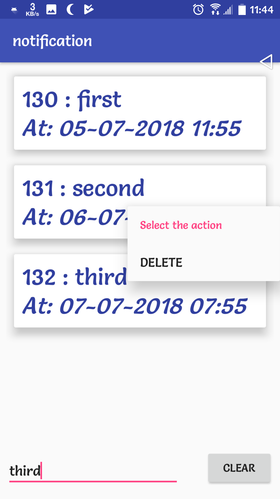

# Scheduler_notification_with_DateTimePicker

## Master branch contains a basic manual notification example:

## Schedule Notification Branch_02 contains a example how to create a scheduled notification using Alarm Manager:

## List of Push Alarm Branch_03 conatins a proper multiple Scheduled notification  app like a todo app:

